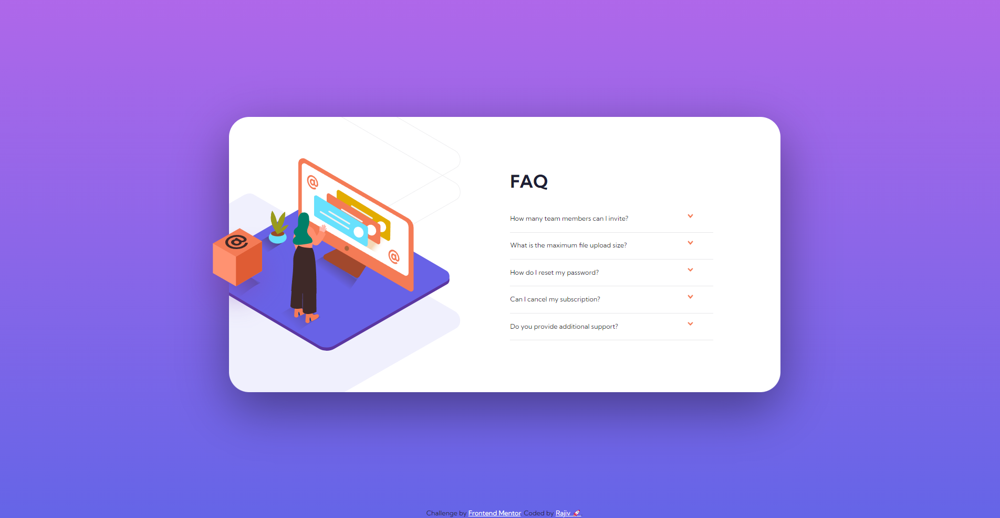

# Frontend Mentor - FAQ accordion card solution
This project is a solution to the [FAQ Accordion Card Challenge on Frontend Mentor](https://www.frontendmentor.io/challenges/faq-accordion-card-XlyjD0Oam). The challenge inspired the design and functionality of this accordion card, focusing on creating an engaging and interactive user interface.

## Table of contents

- [Frontend Mentor - FAQ accordion card solution](#frontend-mentor---faq-accordion-card-solution)
  - [Table of contents](#table-of-contents)
  - [Overview](#overview)
    - [The challenge](#the-challenge)
    - [Screenshot](#screenshot)
    - [Links](#links)
  - [My process](#my-process)
    - [Built with](#built-with)
    - [What I learned](#what-i-learned)
      - [Unveiling the Power of the `<details>` Tag for Interactive FAQs](#unveiling-the-power-of-the-details-tag-for-interactive-faqs)
      - [Using the `<picture>` Tag](#using-the-picture-tag)
      - [CSS Positioning](#css-positioning)
    - [Useful resources](#useful-resources)
  - [Author](#author)
  - [Acknowledgments](#acknowledgments)

## Overview

### The challenge

Users should be able to:

- View the optimal layout for the component depending on their device's screen size
- See hover states for all interactive elements on the page
- Hide/Show the answer to a question when the question is clicked

### Screenshot




### Links

- Solution URL: [FAQ accordion card Repo](https://github.com/Rajiv-0920/FAQ-accordion-card)
- Live Site URL: [Preview of FAQ accordion card](https://Rajiv-0920.github.io/FAQ-accordion-card)

## My process

### Built with

- Semantic HTML5 markup
- CSS custom properties
- Flexbox
- CSS Grid
- Mobile-first workflow

### What I learned

#### Unveiling the Power of the `<details>` Tag for Interactive FAQs

Recently, I explored the powerful `<details>` HTML tag, which allows for creating interactive, collapsible content sections on a webpage. This tag is especially useful for FAQs, where users can click to reveal or hide additional information as needed, making the content more dynamic and user-friendly.

```html
<details>
    <summary class="faq-question">...</summary>
    <p>...</p>
</details>
```

#### Using the `<picture>` Tag

In this project, I learned how to use the <picture> tag in HTML to display different images based on the screen resolution. This approach is useful for serving appropriate images for various device sizes, improving both performance and user experience.

```css
<picture>
    <!-- Image for screens wider than 1050px -->
    <source media="(min-width: 1050px)" srcset="desktop.jpg">
    <!-- Default image for smaller screens -->
    
</picture>
```

#### CSS Positioning

I have learned how to use positioning in CSS to control the placement and layering of elements on a webpage. CSS positioning allows you to specify how elements should be positioned within their containing element or the viewport.

```css
.accordion::before {
    content: "";
    position: absolute;
    top: 200px;
    left: -80px;
}
```

### Useful resources

- [W3Schools](https://www.w3schools.com) - This site helped me learn about the `<details>` tag in CSS in detail. I really liked the clear explanations and practical examples provided, which made understanding and applying the tag much easier.
- [CSS Scan](https://getcssscan.com/css-box-shadow-examples) - Check out CSS Box Shadow Examples for a variety of ready-to-use CSS box-shadow effects to enhance your designs.
- [YahooBaba](https://www.yahoobaba.net) - The video content on YahooBaba was incredibly helpful. It provided a clear and practical demonstration of CSS techniques, particularly on background properties and various other concepts. This resource was valuable for visual learners and greatly assisted in my understanding and application of these CSS properties.
- [ChatGPT](https://www.openai.com/chatgpt) - This is an amazing tool that provided tailored explanations and practical advice on CSS concepts. It helped me finally understand complex topics and apply them effectively. I'd recommend it to anyone still learning these concepts.

## Author

- Website - [Rajiv Kumar 🚀](https://rajiv-0920.github.io/Portfolio/)
- Frontend Mentor - [@rajiv-0920](https://www.frontendmentor.io/profile/rajiv-0920)
- Twitter - [@rajiv_0920](https://www.twitter.com/rajiv_0920)
- Linkedin - [@rajiv-0920](https://www.linkedin.com/in/rajiv-0920/)

## Acknowledgments

I’d like to extend my gratitude to the following for their invaluable contributions to this project:

- [W3Schools](https://www.w3schools.com) - Their detailed tutorials and explanations were instrumental in understanding various CSS properties and techniques.
- [Frontend Mentor Solution](https://www.frontendmentor.io/solutions/faq-accordion-card-HyQU0HoN9): This solution was incredibly helpful for aligning the 3D box. The approach and practical examples provided inspiration and guidance for achieving the desired alignment and visual effects.

Thank you for the guidance and inspiration that greatly contributed to the success of this project!